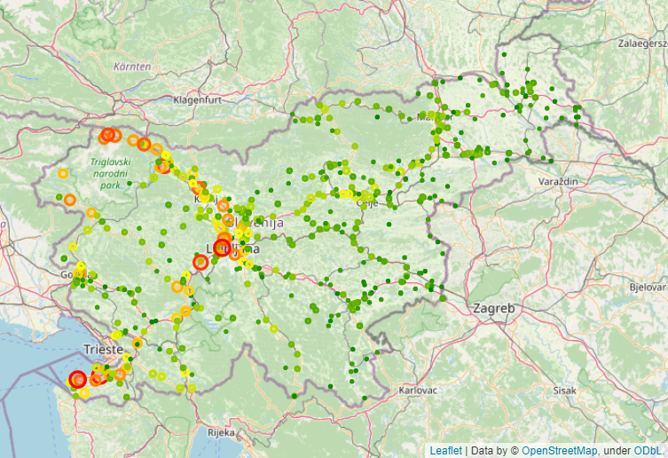
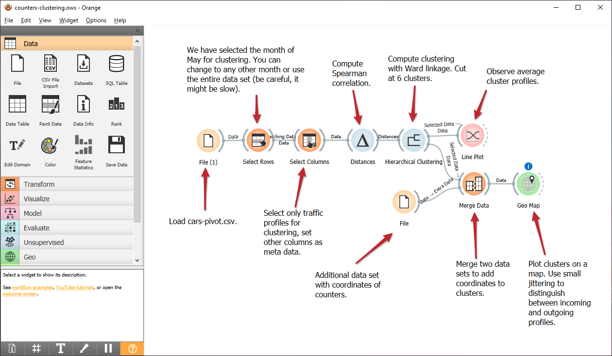
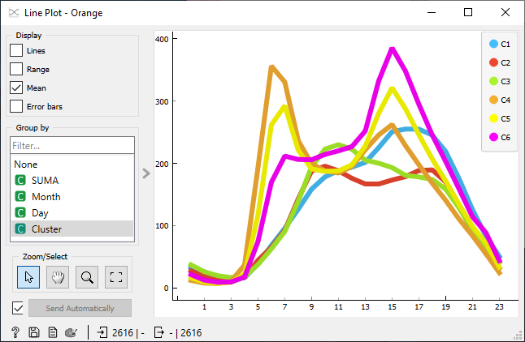

# Traffic flows

Jupyter notebook scripts, Orange workflows, and data that support the findings of the study titled **"Open Data and Quantitative Techniques for Anthropology of Road Traffic."**

### Jupyter notebooks

The included notebooks present examples of handling and visualizing traffic count data. Run the notebook with `jupyter notebook Notebook_Name.ipynb`.

Requirements: `Python`, `Jupyter`, `Pandas`, (`folium` and `branca` for map visualizations)

- `Absolute and relative difference.ipynb`: Presents the concept of baseline traffic and the measure of absolute and relative deviation from it.
- `Basic Sorting.ipynb`: Basic manipulation and visualization of traffic count data.
- `Computing interesting counters.ipynb`: Other measures of traffic profile deviation.
- `Maps.ipynb`: Example visualization of motorbike traffic on Slovenian road network.

An example from notebook `Maps.ipynb` displaying the amount of motorbike traffic on a map where we can observe a larger amount of motorbikes in the western part of the country.

### Orange workflows

Open the workflows with `orange-canvas Workflow_Name.ows`. Workflows include instructions for setting up individual widgets correctly.

Requirements: `Orange3`, (`Orange3-Geo` add-on for map visualizations).

- `coefficient-of-variation.ows`: Computation of one deviation measure for discovery of interesting counters and visualization of the monthly traffic profile of one such traffic counter (Vršič mountain pass).
- `counters-clustering.ows`: Clustering counters by their traffic profiles and visualization of counter locations on a map (see Figure 7).
- `counters-yearly-averages.ows`: Seasonal traffic profile by years in Slovenia (see Figure 2a) 
- `sum-of-mean.ows`: Similar to `coefficient-of-variation.ows` with a different deviation measure and observing the traffic counter on the road from Rogla to Zreče (see Figure 1a).
- `z-score.ows`: Detection of counters with daily peaks using the z-score measure (see Figure 5).

Screenshot of the workflow `counters-clustering.ows` and the Line Plot widget showing the average profiles in the six clusters of traffic profiles.

